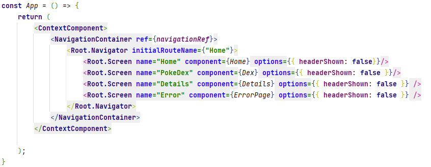

# PokeDex

Installation:

1. Installer Expo app dans le téléphone
2. Lancer le projet
   1. Cloner le projet
   2. lancer la commande: ```npm install```
   3. Lancer la commande: 
      1. ```expo-cli start```

Cela va générer un code QR qu'il va falloir scanner avec l'app EXPO sur le téléphone.

## Description de l'application

L'application est faite en React native typescript avec expo CLI.

Il y a trois écran: 
   * 1 Principal
   * 2 Liste de pokemon
   * 3 Détail d'un pokemon.
   * 4 Page d'érreur si un appel à l'api pokemon échoue.

### 1
Dans l'écran principal on trouve un input text pour saisir le nom de l'utilisateur et la liste de traductions.
Cette input est observé pour validé un nom. Le nom d'un utilisateur doit être un text d'au moins trois charactères.

On trouve aussi le composant de pokeball faite en css

### 2 
Dans l'écran liste de pokemon, on trouve un input text "search pokemon by name" et la liste de pokemon.

Cette "search" est un composant custom.

Par default, la liste est initialisée avec 100 pokemon.

Chaque pokemon posede un button toggle pour le capturé. Si on le capture, le pokemon est sauvegardé en local.

Si on posede des pokemon capturés, on peut coché l'option "afficher les pokemon capturés".

Si on fait click sur l'image d'un pokemon, on va sur l'écran de détail. 

### 3 
Sur cette écran, on affecte dans le model du pokemon, les propiétés extended du model pour afficher la description.

Finalment, pour les traductions, il est gérer avec un composant qui est utilisé dans tout l'application.

"ContextComponent"




